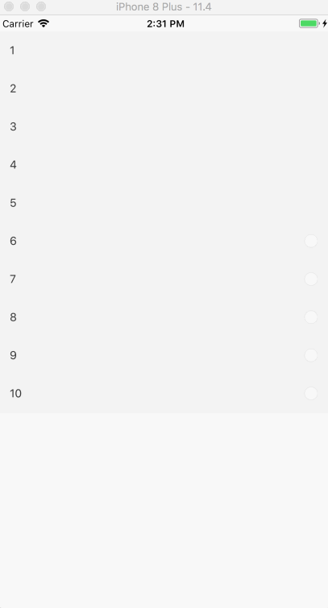

# MultiSelectionTableView

[](https://travis-ci.org/winann/MultiSelectionTableView)
[](https://cocoapods.org/pods/MultiSelectionTableView)
[](https://cocoapods.org/pods/MultiSelectionTableView)
[](https://cocoapods.org/pods/MultiSelectionTableView)

## Example

To run the example project, clone the repo, and run `pod install` from the Example directory first.

## Requirements

## Installation

MultiSelectionTableView is available through [CocoaPods](https://cocoapods.org). To install
it, simply add the following line to your Podfile:

```ruby
pod 'MultiSelectionTableView'
```

## Use

1. import MultiSelectionTableView
2. create MultiSelectionTableView instance( You can use code or xib/ storyboard)
3. add to targe view
4. set sectionModel
5. use `selectResults` get selected items

## Reference



## Configuration

More UI configuration see `MultiSelectionConfig.swift` file.

## Author

winann, winann@126.com

## License

MultiSelectionTableView is available under the MIT license. See the LICENSE file for more info.
